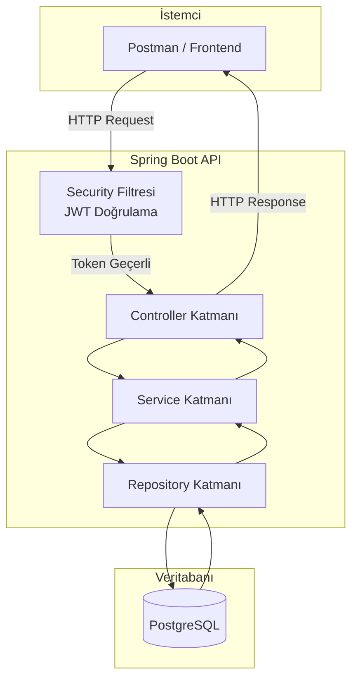
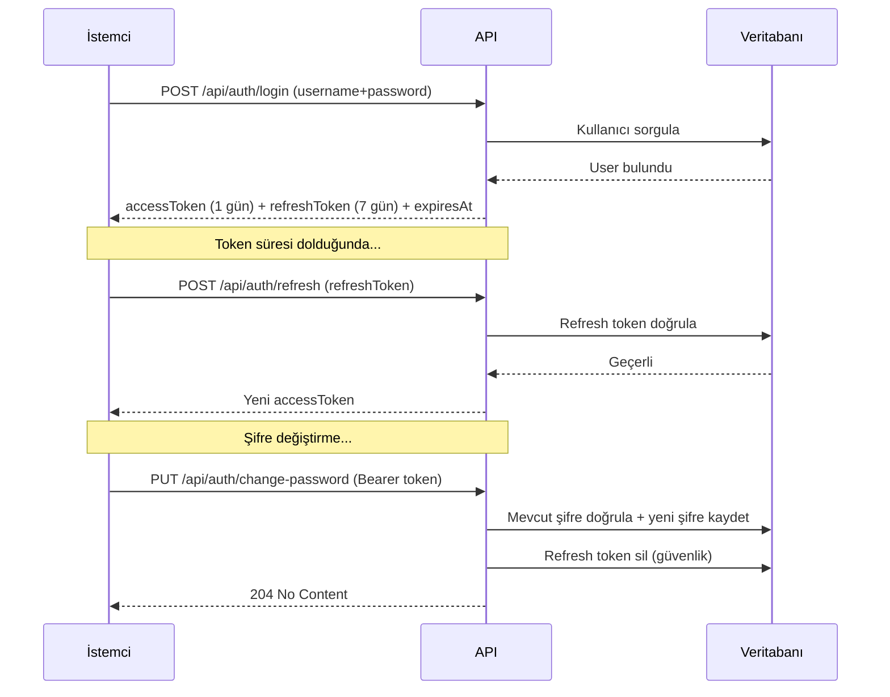
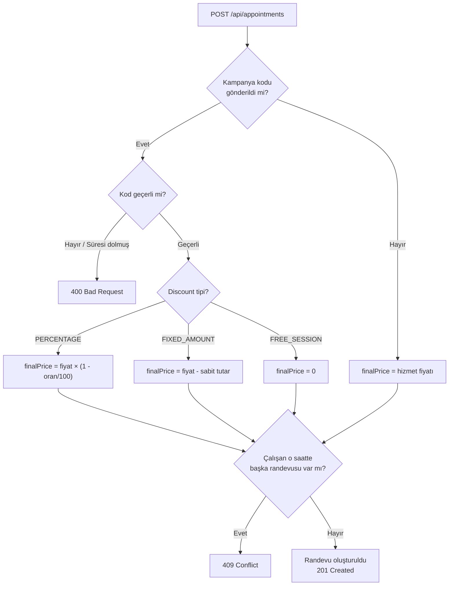
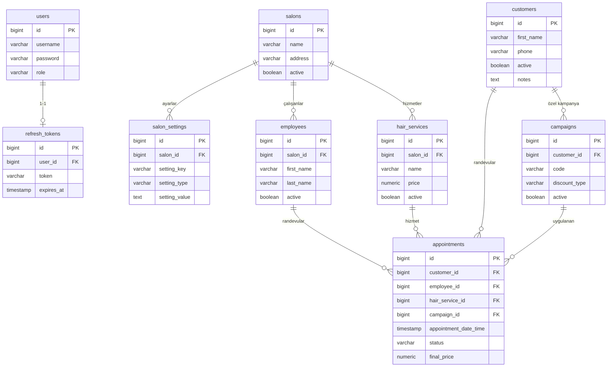

# iHair — Kuaför Yönetim Sistemi

## Proje Amacı

iHair, kuaför salonlarının günlük operasyonlarını dijital ortama taşımak için geliştirilmiş bir **backend yönetim API**'sidir.

**Çözdüğü problemler:**
- Birden fazla salon ve çalışanı tek merkezden yönetme
- Müşteri randevularını takip etme ve çakışmaları otomatik engelleme
- Kampanya / indirim kodları oluşturarak müşteri sadakatini artırma
- Her salonun logo, adres, çalışma saati gibi sabit bilgilerini esnek key-value yapısında saklama
- Rol tabanlı erişim (ADMIN → SALON_OWNER → EMPLOYEE) ile yetkisiz işlemleri engelleme

**Hedef kullanıcılar:**

| Rol | Açıklama |
|---|---|
| `ADMIN` | Sistem yöneticisi, tüm işlemlere tam erişim |
| `SALON_OWNER` | Kendi salonunu, çalışanlarını ve hizmetlerini yönetir |
| `EMPLOYEE` | Müşteri ve randevu işlemlerini yürütür |
| `CUSTOMER` | Kampanya kodlarını doğrulayabilir |

---

## Teknoloji Yığını

| Katman | Teknoloji |
|---|---|
| Dil | Java 25 |
| Framework | Spring Boot 4.0.3 |
| Veritabanı | PostgreSQL 18 |
| ORM | Hibernate 7 / Spring Data JPA |
| Güvenlik | Spring Security 7.0.3 + JWT (jjwt 0.12.6) |
| Yardımcı | Lombok |
| Derleme | Maven |

---

## Sistem Mimarisi



---

## Kimlik Doğrulama Akışı



---

## Randevu ve Kampanya Akışı



---

## Entity İlişkileri (ER Diyagramı)



---

## Proje Yapısı

```
src/main/java/com/bigbear/ihair/
├── common/
│   └── BaseEntity.java                   # id, createdAt, updatedAt
├── config/
│   ├── SecurityConfig.java               # Spring Security + JWT konfigürasyonu
│   └── DataInitializer.java              # Sunucu başlangıcında varsayılan admin oluşturur
├── controller/
│   ├── AuthController.java
│   ├── SalonController.java
│   ├── SalonSettingController.java
│   ├── EmployeeController.java
│   ├── CustomerController.java
│   ├── HairServiceController.java
│   ├── AppointmentController.java
│   └── CampaignController.java
├── dto/
│   ├── request/
│   │   ├── LoginRequestDto.java
│   │   ├── RegisterRequestDto.java
│   │   ├── RefreshTokenRequestDto.java
│   │   ├── ChangePasswordRequestDto.java
│   │   ├── SalonRequestDto.java
│   │   ├── SalonSettingRequestDto.java
│   │   ├── EmployeeRequestDto.java
│   │   ├── CustomerRequestDto.java
│   │   ├── HairServiceRequestDto.java
│   │   ├── AppointmentRequestDto.java
│   │   └── CampaignRequestDto.java
│   └── response/
│       ├── AuthResponseDto.java
│       ├── ErrorResponseDto.java
│       ├── SalonResponseDto.java
│       ├── SalonSettingResponseDto.java
│       ├── EmployeeResponseDto.java
│       ├── CustomerResponseDto.java
│       ├── HairServiceResponseDto.java
│       ├── AppointmentResponseDto.java
│       └── CampaignResponseDto.java
├── entity/
│   ├── enums/
│   │   ├── Role.java                     # ADMIN, SALON_OWNER, EMPLOYEE, CUSTOMER
│   │   ├── AppointmentStatus.java        # PENDING, CONFIRMED, COMPLETED, CANCELLED
│   │   ├── DiscountType.java             # PERCENTAGE, FIXED_AMOUNT, FREE_SESSION
│   │   └── SettingType.java              # TEXT, IMAGE_BASE64, URL, JSON
│   ├── User.java
│   ├── RefreshToken.java
│   ├── Salon.java
│   ├── SalonSetting.java
│   ├── Employee.java
│   ├── Customer.java
│   ├── HairService.java
│   ├── Appointment.java
│   └── Campaign.java
├── exception/
│   ├── GlobalExceptionHandler.java
│   ├── ResourceNotFoundException.java
│   ├── DuplicateResourceException.java
│   ├── BadRequestException.java
│   └── AppointmentConflictException.java
├── repository/
│   ├── UserRepository.java
│   ├── RefreshTokenRepository.java
│   ├── SalonRepository.java
│   ├── SalonSettingRepository.java
│   ├── EmployeeRepository.java
│   ├── CustomerRepository.java
│   ├── HairServiceRepository.java
│   ├── AppointmentRepository.java
│   └── CampaignRepository.java
├── security/
│   ├── JwtService.java
│   ├── JwtAuthenticationFilter.java
│   └── UserDetailsServiceImpl.java
└── service/
    ├── AuthService.java / impl/AuthServiceImpl.java
    ├── SalonService.java / impl/SalonServiceImpl.java
    ├── SalonSettingService.java / impl/SalonSettingServiceImpl.java
    ├── EmployeeService.java / impl/EmployeeServiceImpl.java
    ├── CustomerService.java / impl/CustomerServiceImpl.java
    ├── HairServiceService.java / impl/HairServiceServiceImpl.java
    ├── AppointmentService.java / impl/AppointmentServiceImpl.java
    └── CampaignService.java / impl/CampaignServiceImpl.java
```

---

## Veritabanı Şeması

### Tablolar

| Tablo | Önemli Alanlar |
|---|---|
| `users` | username, password, role |
| `refresh_tokens` | token, user_id (UNIQUE FK), expires_at |
| `salons` | name, address, phone, email, **active** |
| `salon_settings` | salon_id, setting_key, setting_type, setting_value — UNIQUE(salon_id, key) |
| `employees` | first_name, last_name, phone, email, salon_id, **active** |
| `customers` | first_name, last_name, phone, email, notes, **active** |
| `hair_services` | name, description, price, duration_minutes, salon_id, **active** |
| `appointments` | customer_id, employee_id, hair_service_id, appointment_date_time, **status**, campaign_id, final_price |
| `campaigns` | name, code (UNIQUE), discount_type, discount_value, max_usage_count, used_count, is_customer_specific, valid_from, valid_to, **active** |

> **Soft Delete:** Fiziksel silme yoktur.
> - `Salon`, `Employee`, `Customer`, `HairService`, `Campaign`, `SalonSetting` → `active = false` veya fiziksel silme (settings)
> - `Appointment` → `status = CANCELLED`

---

## Kimlik Doğrulama (Auth)

- **Strateji:** Access Token + Refresh Token (Stateless JWT)
- **Access Token Süresi:** 1 gün (86400000 ms)
- **Refresh Token Süresi:** 7 gün
- **Giriş Alanı:** `username` + `password`

### Varsayılan Admin Kullanıcısı

Sunucu ilk başlatıldığında sistemde hiç `ADMIN` rolünde kullanıcı yoksa otomatik olarak oluşturulur:

| Alan | Değer |
|---|---|
| username | `admin` |
| password | `admin123` |
| role | `ADMIN` |

> İlk girişten sonra `PUT /api/auth/change-password` ile şifre değiştirilmesi **zorunludur**.

### Endpoint'ler

| Method | URL | Açıklama | Auth |
|---|---|---|---|
| POST | `/api/auth/login` | Giriş, token döner | - |
| POST | `/api/auth/refresh` | Access token yenile | - |
| POST | `/api/auth/logout` | Refresh token sil | Bearer |
| POST | `/api/auth/register` | Yeni kullanıcı ekle | **Sadece ADMIN** |
| PUT | `/api/auth/change-password` | Şifre değiştir | Bearer |

### Login Yanıtı

```json
{
  "accessToken": "eyJhbGciOiJIUzI1NiJ9...",
  "refreshToken": "eyJhbGciOiJIUzI1NiJ9...",
  "role": "ADMIN",
  "expiresAt": "2026-03-27T10:00:00"
}
```

### Postman'da Token Kullanımı

1. `POST /api/auth/login` isteğini çalıştırın.
2. `Login` isteği otomatik olarak `accessToken` collection değişkenini günceller.
3. Diğer tüm istekler `Bearer {{accessToken}}` ile bu değişkeni kullanır.

> `postman/iHair_API_Collection.json` dosyasını Postman'e import edin.

---

## API Endpoint'leri

### Rol Bazlı Erişim

| Endpoint | ADMIN | SALON_OWNER | EMPLOYEE | CUSTOMER |
|---|:---:|:---:|:---:|:---:|
| `/api/auth/register` | ✅ | ❌ | ❌ | ❌ |
| `/api/auth/change-password` | ✅ | ✅ | ✅ | ✅ |
| `/api/salons/**` | ✅ | ✅ | ❌ | ❌ |
| `/api/salons/*/settings/**` | ✅ | ✅ | ❌ | ❌ |
| `/api/employees/**` | ✅ | ✅ | ❌ | ❌ |
| `/api/hair-services/**` | ✅ | ✅ | ❌ | ❌ |
| `/api/customers/**` | ✅ | ✅ | ✅ | ❌ |
| `/api/appointments/**` | ✅ | ✅ | ✅ | ❌ |
| `/api/campaigns/**` | ✅ | ✅ | ❌ | ❌ |
| `/api/campaigns/validate` | ✅ | ✅ | ✅ | ✅ |

### Salon

| Method | URL | Açıklama |
|---|---|---|
| GET | `/api/salons` | Aktif salonları listele |
| GET | `/api/salons/{id}` | Salon detayı |
| POST | `/api/salons` | Yeni salon oluştur |
| PUT | `/api/salons/{id}` | Salon güncelle |
| DELETE | `/api/salons/{id}` | Salon pasifleştir (soft delete) |

### Salon Ayarları (Salon Settings)

| Method | URL | Açıklama |
|---|---|---|
| GET | `/api/salons/{salonId}/settings` | Salona ait tüm ayarları listele |
| GET | `/api/salons/{salonId}/settings/{key}` | Tek ayarı getir |
| PUT | `/api/salons/{salonId}/settings/{key}` | Ayar ekle veya güncelle (upsert) |
| DELETE | `/api/salons/{salonId}/settings/{key}` | Ayarı sil |

> `key` büyük harfe normalize edilir (`logo` → `LOGO`). `PUT` upsert gibi çalışır.

#### Önerilen Anahtarlar

| Key | Tip | Açıklama |
|---|---|---|
| `LOGO` | `IMAGE_BASE64` | Salon logosu |
| `ADDRESS` | `TEXT` | Açık adres |
| `TAX_NUMBER` | `TEXT` | Vergi kimlik numarası |
| `PHONE_DISPLAY` | `TEXT` | Görünen telefon |
| `EMAIL_DISPLAY` | `TEXT` | Görünen e-posta |
| `WEBSITE` | `URL` | Web sitesi |
| `INSTAGRAM` | `URL` | Instagram profil linki |
| `WORKING_HOURS` | `JSON` | Çalışma saatleri |
| `SLOGAN` | `TEXT` | Salon sloganı |
| `MAP_LINK` | `URL` | Google Maps linki |

### Çalışan (Employee)

| Method | URL | Açıklama |
|---|---|---|
| GET | `/api/employees?salonId=` | Aktif çalışanları listele (salon filtresi opsiyonel) |
| GET | `/api/employees/{id}` | Çalışan detayı |
| POST | `/api/employees` | Yeni çalışan ekle |
| PUT | `/api/employees/{id}` | Çalışan güncelle |
| DELETE | `/api/employees/{id}` | Çalışan pasifleştir (soft delete) |

### Müşteri (Customer)

| Method | URL | Açıklama |
|---|---|---|
| GET | `/api/customers` | Aktif müşterileri listele |
| GET | `/api/customers/{id}` | Müşteri detayı |
| POST | `/api/customers` | Yeni müşteri ekle |
| PUT | `/api/customers/{id}` | Müşteri güncelle |
| DELETE | `/api/customers/{id}` | Müşteri pasifleştir (soft delete) |

### Hizmet (Hair Service)

| Method | URL | Açıklama |
|---|---|---|
| GET | `/api/hair-services?salonId=` | Aktif hizmetleri listele (salon filtresi opsiyonel) |
| GET | `/api/hair-services/{id}` | Hizmet detayı |
| POST | `/api/hair-services` | Yeni hizmet ekle |
| PUT | `/api/hair-services/{id}` | Hizmet güncelle |
| DELETE | `/api/hair-services/{id}` | Hizmet pasifleştir (soft delete) |

### Randevu (Appointment)

| Method | URL | Açıklama |
|---|---|---|
| GET | `/api/appointments` | İptal edilmemiş randevuları listele |
| GET | `/api/appointments/{id}` | Randevu detayı |
| POST | `/api/appointments` | Yeni randevu oluştur |
| PUT | `/api/appointments/{id}` | Randevu güncelle / durumu değiştir |
| DELETE | `/api/appointments/{id}` | Randevuyu iptal et (status=CANCELLED) |

> **Çakışma Kontrolü:** Aynı çalışan için aynı tarih/saate ikinci randevu `409 Conflict` döner.

### Kampanya (Campaign)

| Method | URL | Açıklama |
|---|---|---|
| GET | `/api/campaigns` | Aktif kampanyaları listele |
| GET | `/api/campaigns/{id}` | Kampanya detayı |
| GET | `/api/campaigns/validate?code=` | Kampanya kodunu doğrula |
| POST | `/api/campaigns` | Yeni kampanya oluştur |
| PUT | `/api/campaigns/{id}` | Kampanya güncelle |
| DELETE | `/api/campaigns/{id}` | Kampanya pasifleştir (soft delete) |

> **Otomatik Kod:** `code` alanı boş bırakılırsa sistem `IH-XXXXXXXX` formatında benzersiz kod üretir.

---

## Kampanya Sistemi

### Discount Tipleri

| Tip | Hesaplama | Örnek |
|---|---|---|
| `PERCENTAGE` | `finalPrice = fiyat × (1 - oran/100)` | %20 indirim → 250 TL → 200 TL |
| `FIXED_AMOUNT` | `finalPrice = fiyat - tutar` | 100 TL indirim → 250 TL → 150 TL |
| `FREE_SESSION` | `finalPrice = 0` | Ücretsiz seans |

### Kampanya Oluşturma Örnekleri

**Yüzde indirim:**
```json
{
  "name": "Kurucu Üye Kampanyası",
  "discountType": "PERCENTAGE",
  "discountValue": 20,
  "code": "KURUCU50",
  "maxUsageCount": 50,
  "validFrom": "2026-03-01T00:00:00",
  "validTo": "2026-12-31T23:59:59"
}
```

**Müşteriye özel (otomatik kod):**
```json
{
  "name": "VIP Müşteri İndirimi",
  "discountType": "FIXED_AMOUNT",
  "discountValue": 100,
  "isCustomerSpecific": true,
  "customerId": 1,
  "maxUsageCount": 1
}
```

**Kampanyalı randevu:**
```json
{
  "customerId": 1,
  "employeeId": 1,
  "hairServiceId": 1,
  "appointmentDateTime": "2026-04-01T10:00:00",
  "campaignCode": "KURUCU50"
}
```

Yanıtta `finalPrice` hesaplanmış indirimli fiyatı içerir.

---

## Hata Kodları

| HTTP Kodu | Durum | Senaryo |
|---|---|---|
| 200 | OK | Başarılı GET / PUT |
| 201 | Created | Başarılı POST |
| 204 | No Content | Başarılı DELETE / change-password |
| 400 | Bad Request | Geçersiz istek, yanlış şifre, süresi dolmuş kampanya |
| 401 | Unauthorized | Token eksik veya geçersiz |
| 403 | Forbidden | Yetersiz rol |
| 404 | Not Found | Kaynak bulunamadı veya pasif |
| 409 | Conflict | Mükerrer kayıt, randevu çakışması |
| 500 | Internal Server Error | Beklenmeyen sunucu hatası |

### Hata Yanıtı Formatı

```json
{
  "timestamp": "2026-03-26T10:00:00",
  "status": 409,
  "error": "Conflict",
  "message": "Bu çalışan için 2026-04-01T10:00 saatinde zaten aktif bir randevu mevcut.",
  "path": "/api/appointments"
}
```

---

## Kurulum ve Çalıştırma

### Gereksinimler

- Java 25+
- Maven 3.9+

### Profiller

| Profil | Veritabanı | Kullanım |
|---|---|---|
| `default` (boş) | Local PostgreSQL (`localhost:5432`) | Geliştirme |
| `dev` | H2 (dosya tabanlı) | PostgreSQL kurulu değilse |
| `prod` | Neon PostgreSQL (cloud) | Production / Test |

---

### Local Geliştirme

`application.properties` zaten yapılandırılmıştır. Doğrudan çalıştırın:

```bash
mvn spring-boot:run
```

---

### Production — Neon PostgreSQL

#### 1. .env Dosyasını Hazırla

```bash
cp .env.example .env
```

`.env` dosyasını düzenle:

```env
DATABASE_URL=jdbc:postgresql://ep-xxx.region.aws.neon.tech/neondb?sslmode=require&channel_binding=require
DATABASE_USERNAME=neondb_owner
DATABASE_PASSWORD=your-password
JWT_SECRET=en-az-64-karakter-guclu-rastgele-string
SPRING_PROFILES_ACTIVE=prod
```

> Neon bağlantı string'i: [neon.tech](https://neon.tech) → Proje → **Connect** → **JDBC** formatını seç.  
> `postgresql://` → `jdbc:postgresql://` olarak değiştir, `user:pass@` kısmını çıkar.

#### 2. Uygulamayı Prod Profiliyle Başlat

**Windows (PowerShell):**
```powershell
$env:SPRING_PROFILES_ACTIVE="prod"
$env:DATABASE_URL="jdbc:postgresql://ep-xxx.neon.tech/neondb?sslmode=require&channel_binding=require"
$env:DATABASE_USERNAME="neondb_owner"
$env:DATABASE_PASSWORD="your-password"
$env:JWT_SECRET="your-jwt-secret"
mvn spring-boot:run
```

**Linux / Mac:**
```bash
export SPRING_PROFILES_ACTIVE=prod
export DATABASE_URL=jdbc:postgresql://ep-xxx.neon.tech/neondb?sslmode=require&channel_binding=require
export DATABASE_USERNAME=neondb_owner
export DATABASE_PASSWORD=your-password
export JWT_SECRET=your-jwt-secret
mvn spring-boot:run
```

**JAR ile (sunucuda):**
```bash
java -jar target/ihair-0.0.1-SNAPSHOT.jar \
  --spring.profiles.active=prod \
  --DATABASE_URL=jdbc:postgresql://... \
  --DATABASE_USERNAME=neondb_owner \
  --DATABASE_PASSWORD=your-password \
  --JWT_SECRET=your-secret
```

#### 3. Başarılı Bağlantı Kontrolü

Uygulama başlarken logda şunları görmelisiniz:

```
Hibernate: create table if not exists users (...)
Hibernate: create table if not exists salons (...)
...
>>> Varsayılan admin kullanıcısı oluşturuldu.
Tomcat started on port 8080
```

Tablolar Neon dashboard'unda **Tables** sekmesinde görünmeye başlar.

---

> `.env` dosyası `.gitignore`'a eklenmiştir — git'e gönderilmez.  
> `.env.example` şablon olarak commit'lenir, gerçek değer içermez.

---

## Postman Collection

`postman/iHair_API_Collection.json` dosyasını Postman'e import edin.

- Collection değişkenleri: `baseUrl` (`http://localhost:8080`), `accessToken`
- `Login` isteği çalıştırıldığında `accessToken` collection değişkeni otomatik güncellenir
- Tüm endpoint'ler örnek request body'leriyle hazırdır
- 8 klasör: Auth, Salons, Salon Settings, Employees, Customers, Hair Services, Appointments, Campaigns
